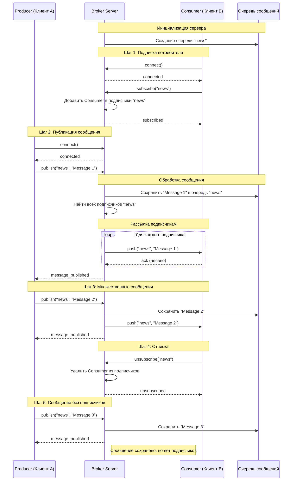
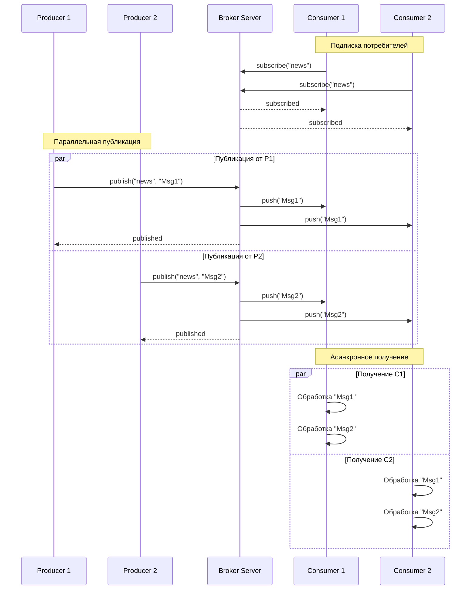

# Асинхронный обмен сообщениями: принцип работы и диаграмма последовательностей

## Пошаговое объяснение принципа работы

### Шаг 1: Инициализация сервера
```
Клиент A (Producer)          Сервер-брокер           Клиент B (Consumer)
     |                            |                         |
     |--- 1. Запуск сервера ----->|                         |
     |                            |                         |
     |--- 2. Подключение -------->|                         |
     |                            |--- 3. Подключение ----->|
```

### Шаг 2: Подписка потребителя
```
Клиент A          Сервер-брокер           Клиент B
     |                  |                     |
     |                  |--- subscribe("news")|
     |                  |<--------------------|
     |                  |                     |
     |                  |--- ok ------------->|
     |                  |-------------------->|
```

### Шаг 3: Публикация сообщения
```
Клиент A          Сервер-брокер           Клиент B
     |                  |                     |
     |--- publish("news", "Hello")            |
     |----------------->|                     |
     |                  |--- push("Hello") ---|
     |                  |-------------------->|
     |                  |                     |
     |<--- ok ----------|                     |
```

## Подробная диаграмма последовательностей Mermaid



## Детальное пошаговое объяснение

### Фаза 1: Подготовка и подключение

**Шаг 1.1 - Запуск брокера:**
```python
# Сервер запускается и слушает порт
server = await asyncio.start_server(handle_client, 'localhost', 8888)
```

**Шаг 1.2 - Подключение клиентов:**
```python
# Consumer подключается
reader, writer = await asyncio.open_connection('localhost', 8888')

# Producer подключается  
reader, writer = await asyncio.open_connection('localhost', 8888')
```

### Фаза 2: Подписка на сообщения

**Шаг 2.1 - Запрос подписки:**
```json
// Consumer отправляет:
{
  "action": "subscribe",
  "topic": "news"
}
```

**Шаг 2.2 - Обработка подписки сервером:**
```python
def process_subscribe(topic, writer):
    if topic not in subscribers:
        subscribers[topic] = []
    subscribers[topic].append(writer)  # Добавляем в список подписчиков
```

**Шаг 2.3 - Подтверждение подписки:**
```json
// Сервер отвечает:
{
  "status": "subscribed", 
  "topic": "news"
}
```

### Фаза 3: Публикация сообщений

**Шаг 3.1 - Отправка сообщения:**
```json
// Producer отправляет:
{
  "action": "publish",
  "topic": "news",
  "message": "Hello World!"
}
```

**Шаг 3.2 - Сохранение в очередь:**
```python
def process_publish(topic, message):
    if topic not in queues:
        queues[topic] = []
    queues[topic].append(message)  # Сохраняем сообщение
```

**Шаг 3.3 - Рассылка подписчикам:**
```python
async def notify_subscribers(topic, message):
    if topic in subscribers:
        for subscriber in subscribers[topic]:
            # Асинхронно отправляем каждому подписчику
            await send_message(subscriber, message)
```

**Шаг 3.4 - Получение потребителем:**
```json
// Consumer получает:
{
  "type": "message",
  "topic": "news", 
  "data": "Hello World!"
}
```

## Диаграмма обработки множественных клиентов



## Диаграмма асинхронной обработки на сервере

```mermaid
sequenceDiagram
    participant Client as Клиент
    participant Loop as Event Loop
    participant Handler as Обработчик
    participant Queue as Очередь
    participant Subscribers as Подписчики

    Client->>Loop: Отправка сообщения
    Loop->>Handler: Вызов handle_client()
    
    par Обработка сообщения
        Handler->>Queue: Сохранить в очередь
    and Уведомление подписчиков
        Handler->>Subscribers: Найти подписчиков
        loop Для каждого подписчика
            Handler->>Subscribers: Асинхронная отправка
        end
    end
    
    Handler-->>Client: Ответ об успехе
    Note over Handler: Все операции неблокирующие
```

## Ключевые принципы асинхронности:

### 1. **Неблокирующие операции:**
```python
async def handle_client(reader, writer):
    data = await reader.read(100)  # ⏸️ Ожидание данных без блокировки
    # ... обработка ...
    writer.write(response)         # 📤 Отправка ответа
    await writer.drain()           # ⏸️ Ожидание отправки
```

### 2. **Параллельная обработка:**
```python
# Множество клиентов обрабатываются одновременно
async def main():
    server = await asyncio.start_server(handle_client, 'localhost', 8888)
    await server.serve_forever()  # 🔄 Непрерывная обработка
```

### 3. **Event-Driven архитектура:**
```
События:                    Действия:
├── Подключение клиента  →  Создание задачи обработки
├── Получение сообщения  →  Сохранение + рассылка  
├── Отправка сообщения   →  Неблокирующая запись
└── Отключение клиента   →  Очистка ресурсов
```

## Преимущества асинхронного подхода:

1. **🗂️ Масштабируемость** - тысячи одновременных подключений
2. **⚡ Эффективность** - нет блокировок потока выполнения
3. **🔧 Простота** - линейный код вместо callback hell
4. **🚀 Производительность** - минимальные накладные расходы
