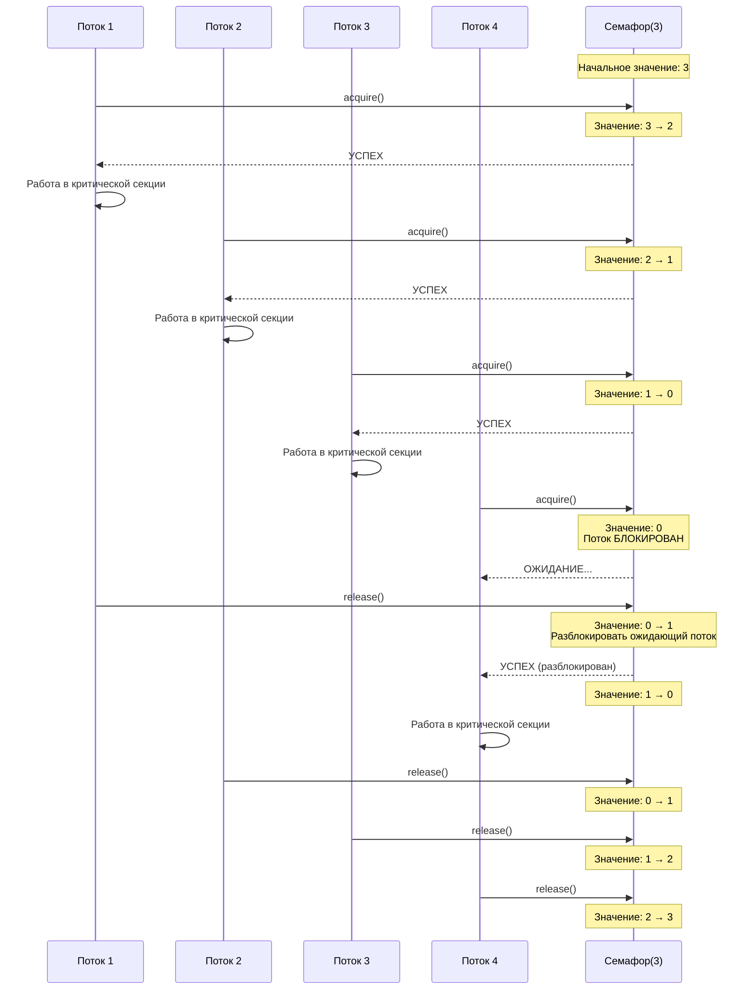
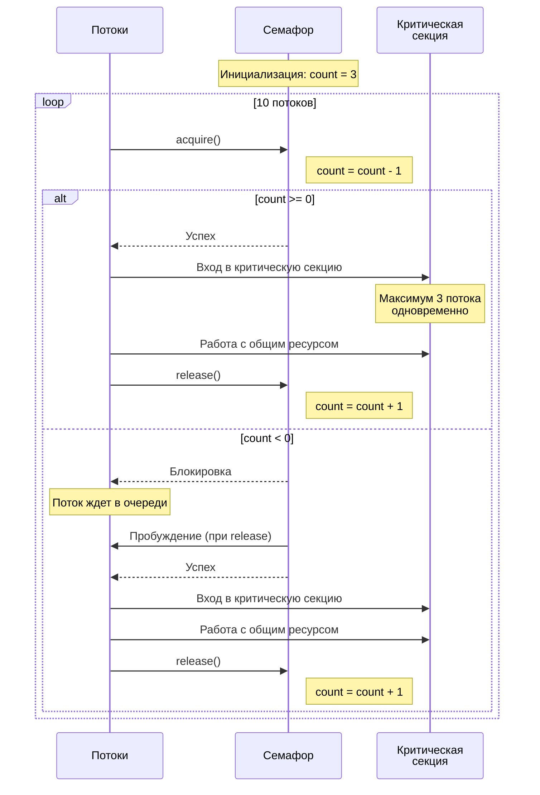
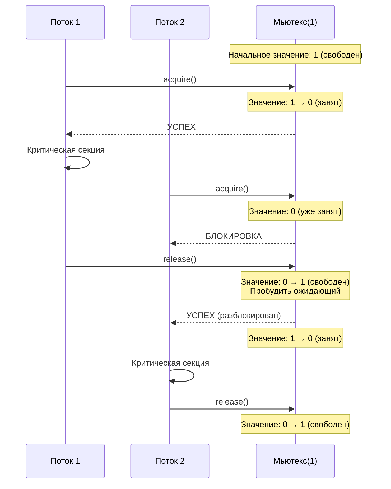
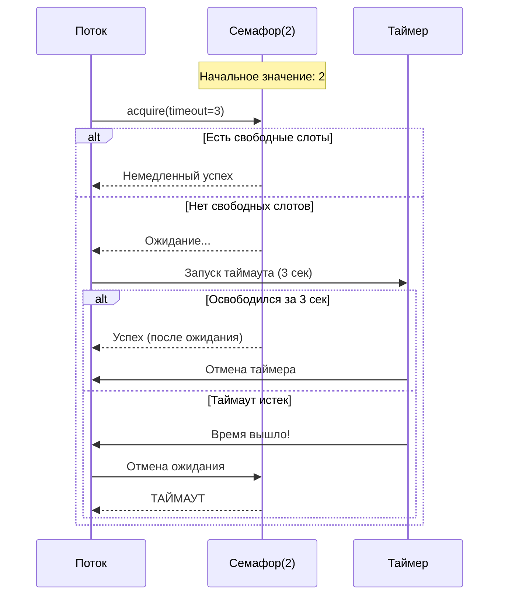

# Семафоры: подробное объяснение
# Диаграмма последовательности работы семафора



## Альтернативная диаграмма - более детальная:



## Диаграмма для бинарного семафора (мьютекс):



## Диаграмма с таймаутом:



## Объяснение ключевых моментов:

### 1. **Состояния семафора**:
- **Положительное значение**: Количество доступных слотов
- **Ноль**: Все слоты заняты, но нет ожидающих
- **Отрицательное значение**: Абсолютное значение показывает количество ожидающих потоков

### 2. **Операции**:
- **acquire()**: Уменьшает счетчик. Если < 0 - блокируется.
- **release()**: Увеличивает счетчик. Если есть ожидающие - будит одного.

### 3. **Поведение**:
- **Справедливость**: Обычно FIFO (первый пришел - первый обслужен)
- **Атомарность**: Операции неделимы (не могут быть прерваны)
- **Блокировка**: Потоки спят, а не busy-wait (экономят CPU)

Эта визуализация помогает понять, как семафоры координируют доступ множества потоков к ограниченным ресурсам! 🎯

## Что такое семафор?

**Семафор** - это механизм синхронизации, используемый в многопоточном и многопроцессном программировании для управления доступом к общим ресурсам.

### Простая аналогия
Представьте себе **столовую с ограниченным количеством мест**:
- **Столовая** - общий ресурс
- **Количество мест** - значение семафора
- **Посетители** - потоки/процессы
- **Занять место** - захватить семафор (`acquire`)
- **Освободить место** - освободить семафор (`release`)

## Основные концепции

### Счетчик семафора
Семафор содержит внутренний счетчик, который:
- Уменьшается при захвате (`acquire`)
- Увеличивается при освобождении (`release`)
- Не может быть отрицательным (для обычных семафоров)

### Типы семафоров

#### 1. Бинарный семафор (Mutex)
- Значение: 0 или 1
- Используется для взаимоисключений (mutual exclusion)
- Только один поток может захватить ресурс

#### 2. Счетный семафор
- Значение: любое неотрицательное целое число
- Ограничивает количество потоков, которые могут одновременно получить доступ к ресурсу

## Реализация семафоров в Python

### Использование `threading.Semaphore`

```python
import threading
import time
import random

# Создание семафора с начальным значением 3
semaphore = threading.Semaphore(3)

def worker(worker_id):
    """Функция рабочего потока"""
    print(f"Работник {worker_id} ждет доступа...")
    
    # Захват семафора
    semaphore.acquire()
    
    try:
        print(f"Работник {worker_id} получил доступ!")
        # Имитация работы
        time.sleep(random.uniform(1, 3))
        print(f"Работник {worker_id} завершил работу.")
    finally:
        # Освобождение семафора
        semaphore.release()
        print(f"Работник {worker_id} освободил доступ.")

# Создание и запуск потоков
threads = []
for i in range(10):
    t = threading.Thread(target=worker, args=(i,))
    threads.append(t)
    t.start()

# Ожидание завершения всех потоков
for t in threads:
    t.join()

print("Все работы завершены!")
```

## Детальный разбор работы кода

### Инициализация:
```python
semaphore = threading.Semaphore(3)
```
Создается семафор со значением 3 - это означает, что одновременно могут работать **3 потока**.

### Визуализация работы:

```
Время │ Работающие потоки │ Очередь
──────┼───────────────────┼─────────
 t=0  │ 0, 1, 2           │ 3,4,5,6,7,8,9
 t=1  │ 0, 1, 3           │ 4,5,6,7,8,9,2
 t=2  │ 1, 3, 4           │ 5,6,7,8,9,2,0
```

### Пошаговое выполнение:

**Шаг 1: Запуск первых 3 потоков**
```python
# Одновременно запускаются потоки 0, 1, 2
# Все они успевают захватить семафор до того, как его значение станет 0

Состояние семафора: 3 → 2 → 1 → 0
```

**Шаг 2: Потоки 3-9 ждут в очереди**
```python
# Потоки 3, 4, 5, 6, 7, 8, 9 пытаются захватить семафор,
# но он уже имеет значение 0, поэтому они блокируются
```

**Шаг 3: Освобождение и получение доступа**
```python
# Когда один из работающих потоков (например, поток 0) 
# вызывает semaphore.release(), значение семафора: 0 → 1

# Один из ожидающих потоков (например, поток 3) 
# разблокируется и захватывает семафор: 1 → 0
```

## Модифицированный код с подробным логированием

Давайте улучшим пример, чтобы лучше видеть, что происходит:

```python
import threading
import time
import random

# Создание семафора с начальным значением 3
semaphore = threading.Semaphore(3)

def worker(worker_id):
    """Функция рабочего потока"""
    print(f"[{time.strftime('%H:%M:%S')}] Работник {worker_id} ждет доступа...")
    
    # Захват семафора
    semaphore.acquire()
    
    try:
        print(f"[{time.strftime('%H:%M:%S')}] 🟢 Работник {worker_id} получил доступ! "
              f"(сейчас работают: {get_active_workers()})")
        
        # Имитация работы
        work_time = random.uniform(1, 3)
        time.sleep(work_time)
        
        print(f"[{time.strftime('%H:%M:%S')}] ✅ Работник {worker_id} завершил работу "
              f"(работал {work_time:.1f} сек)")
    finally:
        # Освобождение семафора
        semaphore.release()
        print(f"[{time.strftime('%H:%M:%S')}] 🔴 Работник {worker_id} освободил доступ.")

# Список для отслеживания активных работников
active_workers = []
active_workers_lock = threading.Lock()

def get_active_workers():
    with active_workers_lock:
        return active_workers.copy()

def worker_enhanced(worker_id):
    """Улучшенная функция рабочего потока с отслеживанием"""
    print(f"[{time.strftime('%H:%M:%S')}] Работник {worker_id} ждет доступа...")
    
    # Захват семафора
    semaphore.acquire()
    
    # Добавляем в список активных работников
    with active_workers_lock:
        active_workers.append(worker_id)
    
    try:
        print(f"[{time.strftime('%H:%M:%S')}] 🟢 Работник {worker_id} получил доступ! "
              f"(активные: {sorted(active_workers)})")
        
        # Имитация работы
        work_time = random.uniform(1, 3)
        time.sleep(work_time)
        
        print(f"[{time.strftime('%H:%M:%S')}] ✅ Работник {worker_id} завершил работу "
              f"(работал {work_time:.1f} сек)")
    finally:
        # Убираем из списка активных работников
        with active_workers_lock:
            active_workers.remove(worker_id)
        
        # Освобождение семафора
        semaphore.release()
        print(f"[{time.strftime('%H:%M:%S')}] 🔴 Работник {worker_id} освободил доступ. "
              f"(остались: {sorted(active_workers)})")

print("🚀 Запускаем 10 работников с ограничением в 3 одновременных доступа\n")

# Создание и запуск потоков
threads = []
for i in range(10):
    t = threading.Thread(target=worker_enhanced, args=(i,))
    threads.append(t)
    t.start()
    time.sleep(0.1)  # Небольшая задержка между запусками для наглядности

# Ожидание завершения всех потоков
for t in threads:
    t.join()

print("\n🎉 Все работы завершены!")
```

## Пример вывода (упрощенный):

```
🚀 Запускаем 10 работников с ограничением в 3 одновременных доступа

[14:30:01] Работник 0 ждет доступа...
[14:30:01] 🟢 Работник 0 получил доступ! (активные: [0])
[14:30:01] Работник 1 ждет доступа...
[14:30:01] 🟢 Работник 1 получил доступ! (активные: [0, 1])
[14:30:01] Работник 2 ждет доступа...
[14:30:01] 🟢 Работник 2 получил доступ! (активные: [0, 1, 2])
[14:30:01] Работник 3 ждет доступа...
[14:30:01] Работник 4 ждет доступа...
[14:30:01] Работник 5 ждет доступа...
[14:30:02] ✅ Работник 1 завершил работу (работал 1.2 сек)
[14:30:02] 🔴 Работник 1 освободил доступ. (остались: [0, 2])
[14:30:02] 🟢 Работник 3 получил доступ! (активные: [0, 2, 3])
[14:30:03] ✅ Работник 0 завершил работу (работал 2.1 сек)
[14:30:03] 🔴 Работник 0 освободил доступ. (остались: [2, 3])
[14:30:03] 🟢 Работник 4 получил доступ! (активные: [2, 3, 4])
...
```

## Ключевые моменты, которые демонстрирует этот код:

1. **Ограничение одновременного доступа**: Не более 3 потоков работают одновременно
2. **Очередь ожидания**: Потоки 3-9 ждут в очереди, пока не освободится место
3. **Автоматическое пробуждение**: Когда поток освобождает семафор, один из ожидающих потоков автоматически получает доступ
4. **Безопасность**: Использование `try-finally` гарантирует, что семафор будет освобожден даже при возникновении исключения
5. **Честность**: Обычно потоки получают доступ в порядке очереди (FIFO)

## Что происходит внутри семафора:

- **`.acquire()`**: Уменьшает счетчик. Если счетчик > 0 - поток продолжает работу. Если счетчик = 0 - поток блокируется.
- **`.release()`**: Увеличивает счетчик и разблокирует один ожидающий поток.

Этот паттерн чрезвычайно полезен для:
- Ограничения одновременных подключений к базе данных
- Контроля использования памяти/CPU
- Ограничения API запросов
- Управления пулом ресурсов


## Бинарный семафор (Mutex)

```python
import threading

# Бинарный семафор (значение 1)
mutex = threading.Semaphore(1)

shared_counter = 0

def increment_counter(thread_id):
    global shared_counter
    
    for _ in range(5):
        # Захват мьютекса
        mutex.acquire()
        
        try:
            # Критическая секция
            current = shared_counter
            print(f"Поток {thread_id}: читает значение {current}")
            time.sleep(0.1)  # Имитация работы
            shared_counter = current + 1
            print(f"Поток {thread_id}: записывает значение {shared_counter}")
        finally:
            # Освобождение мьютекса
            mutex.release()
        
        time.sleep(0.01)

# Запуск потоков
threads = []
for i in range(3):
    t = threading.Thread(target=increment_counter, args=(i,))
    threads.append(t)
    t.start()

for t in threads:
    t.join()

print(f"Финальное значение счетчика: {shared_counter}")
```
Отличный пример! Давайте разберем его работу подробно. Этот код демонстрирует **взаимоисключение (mutual exclusion)** с помощью бинарного семафора.

## Что происходит в программе:

### Инициализация:
```python
mutex = threading.Semaphore(1)  # Бинарный семафор (только 0 или 1)
shared_counter = 0  # Общая переменная, которую защищаем
```

## Детальный разбор работы:

### Без мьютекса (проблема):
```
Поток 1: читает shared_counter = 0
Поток 2: читает shared_counter = 0  # ← ОБА видят 0!
Поток 1: записывает 0 + 1 = 1
Поток 2: записывает 0 + 1 = 1       # ← ДОЛЖНО БЫТЬ 2, но получилось 1!
```

### С мьютексом (решение):
```
Поток 1: захватывает мьютекс
Поток 1: читает 0 → записывает 1
Поток 1: освобождает мьютекс
Поток 2: захватывает мьютекс
Поток 2: читает 1 → записывает 2
Поток 2: освобождает мьютекс
```

## Визуализация выполнения:

```python
import threading
import time

# Бинарный семафор (значение 1) - только один поток может захватить
mutex = threading.Semaphore(1)

shared_counter = 0

def increment_counter(thread_id):
    global shared_counter
    
    for i in range(5):
        print(f"[{time.strftime('%H:%M:%S')}] Поток {thread_id} пытается захватить мьютекс (итерация {i+1})")
        
        # ЗАХВАТ: Если мьютекс занят - поток блокируется здесь
        mutex.acquire()
        
        try:
            print(f"[{time.strftime('%H:%M:%S')}] 🟢 Поток {thread_id} вошел в критическую секцию")
            
            # КРИТИЧЕСКАЯ СЕКЦИЯ - только один поток может выполнять этот код
            current = shared_counter
            print(f"   Поток {thread_id}: читает значение {current}")
            
            # Имитация работы (чтение/обработка/запись)
            time.sleep(0.1)
            
            shared_counter = current + 1
            print(f"   Поток {thread_id}: записывает значение {shared_counter}")
            
        finally:
            # ОСВОБОЖДЕНИЕ: всегда выполняется, даже если было исключение
            mutex.release()
            print(f"[{time.strftime('%H:%M:%S')}] 🔴 Поток {thread_id} вышел из критической секции")
        
        # Небольшая пауза между итерациями
        time.sleep(0.01)

print("🚀 Запускаем 3 потока, каждый увеличивает счетчик 5 раз")
print("📊 Ожидаемый результат: 3 потока × 5 итераций = 15")
print("=" * 50)

# Запуск потоков
threads = []
for i in range(3):
    t = threading.Thread(target=increment_counter, args=(i,))
    threads.append(t)
    t.start()

# Ожидание завершения всех потоков
for t in threads:
    t.join()

print("=" * 50)
print(f"🎯 Финальное значение счетчика: {shared_counter}")
print(f"✅ Ожидалось: 15, Получилось: {shared_counter} - {'СОВПАЛО!' if shared_counter == 15 else 'ОШИБКА!'}")
```

## Пример вывода программы:

```
🚀 Запускаем 3 потока, каждый увеличивает счетчик 5 раз
📊 Ожидаемый результат: 3 потока × 5 итераций = 15
==================================================
[14:35:01] Поток 0 пытается захватить мьютекс (итерация 1)
[14:35:01] 🟢 Поток 0 вошел в критическую секцию
   Поток 0: читает значение 0
   Поток 0: записывает значение 1
[14:35:01] 🔴 Поток 0 вышел из критической секции
[14:35:01] Поток 1 пытается захватить мьютекс (итерация 1)
[14:35:01] 🟢 Поток 1 вошел в критическую секцию
   Поток 1: читает значение 1
   Поток 1: записывает значение 2
[14:35:01] 🔴 Поток 1 вышел из критической секции
[14:35:01] Поток 2 пытается захватить мьютекс (итерация 1)
[14:35:01] 🟢 Поток 2 вошел в критической секции
   Поток 2: читает значение 2
   Поток 2: записывает значение 3
[14:35:01] 🔴 Поток 2 вышел из критической секции
[14:35:01] Поток 0 пытается захватить мьютекс (итерация 2)
[14:35:01] 🟢 Поток 0 вошел в критическую секцию
   Поток 0: читает значение 3
   Поток 0: записывает значение 4
...
==================================================
🎯 Финальное значение счетчика: 15
✅ Ожидалось: 15, Получилось: 15 - СОВПАЛО!
```

## Что было бы БЕЗ мьютекса:

```python
import threading
import time

shared_counter = 0

def increment_counter_broken(thread_id):
    global shared_counter
    
    for _ in range(5):
        # КРИТИЧЕСКАЯ СЕКЦИЯ БЕЗ ЗАЩИТЫ
        current = shared_counter
        print(f"Поток {thread_id}: читает значение {current}")
        
        time.sleep(0.1)  # В это время другие потоки тоже могут читать старое значение
        
        shared_counter = current + 1
        print(f"Поток {thread_id}: записывает значение {shared_counter}")
        
        time.sleep(0.01)

print("🚨 Запуск БЕЗ мьютекса (демонстрация гонки данных):")
threads = []
for i in range(3):
    t = threading.Thread(target=increment_counter_broken, args=(i,))
    threads.append(t)
    t.start()

for t in threads:
    t.join()

print(f"💥 Финальное значение: {shared_counter} (должно быть 15)")
```

**Вывод без мьютекса (пример):**
```
Поток 0: читает значение 0
Поток 1: читает значение 0  # ← ОБА прочитали 0!
Поток 2: читает значение 0  # ← ТРОЕ прочитали 0!
Поток 0: записывает значение 1
Поток 1: записывает значение 1  # ← Должно быть 2!
Поток 2: записывает значение 1  # ← Должно быть 3!
...
💥 Финальное значение: 5 (должно быть 15)
```

## Ключевые моменты:

### 1. **Критическая секция**:
```python
# Этот код выполняется ТОЛЬКО одним потоком одновременно:
current = shared_counter
time.sleep(0.1)  # Имитация работы
shared_counter = current + 1
```

### 2. **Захват и освобождение**:
- `mutex.acquire()` - блокирует, если мьютекс занят
- `mutex.release()` - освобождает для следующего потока

### 3. **try-finally гарантия**:
```python
mutex.acquire()
try:
    # критическая секция
finally:
    mutex.release()  # ВСЕГДА выполнится, даже при ошибке
```

### 4. **Порядок потоков**:
Потоки получают мьютекс примерно в порядке очереди (не строго гарантировано, но обычно FIFO).

## Почему это работает:

1. **Атомарность операций**: Чтение-изменение-запись защищены от прерываний
2. **Визуализация состояния мьютекса**:
   - `1` - свободен
   - `0` - занят, есть ожидающие
3. **Чередование потоков**: Потоки работают по очереди в критической секции

Этот паттерн фундаментально важен для многопоточного программирования! 🛡️

## Семафоры с таймаутом

```python
import threading
import time

semaphore = threading.Semaphore(2)

def worker_with_timeout(worker_id):
    print(f"Работник {worker_id} пытается получить доступ...")
    
    # Попытка захвата семафора с таймаутом 2 секунды
    acquired = semaphore.acquire(timeout=2)
    
    if acquired:
        try:
            print(f"Работник {worker_id} получил доступ!")
            time.sleep(3)  # Долгая работа
            print(f"Работник {worker_id} завершил работу.")
        finally:
            semaphore.release()
    else:
        print(f"Работник {worker_id} не дождался доступа и ушел!")

# Запуск потоков
threads = []
for i in range(5):
    t = threading.Thread(target=worker_with_timeout, args=(i,))
    threads.append(t)
    t.start()
    time.sleep(0.5)  # Задержка между запусками

for t in threads:
    t.join()
```

## Практические примеры использования

### Пример 1: Ограничение подключений к базе данных

```python
import threading
import time
import random

class DatabaseConnectionPool:
    def __init__(self, max_connections=5):
        self.semaphore = threading.Semaphore(max_connections)
        self.active_connections = 0
        self.lock = threading.Lock()
    
    def get_connection(self, thread_id):
        print(f"Поток {thread_id} запрашивает подключение...")
        
        self.semaphore.acquire()
        
        with self.lock:
            self.active_connections += 1
            print(f"Поток {thread_id} получил подключение. Активных подключений: {self.active_connections}")
        
        # Имитация работы с БД
        time.sleep(random.uniform(1, 2))
        
        self.release_connection(thread_id)
    
    def release_connection(self, thread_id):
        with self.lock:
            self.active_connections -= 1
            print(f"Поток {thread_id} освободил подключение. Активных подключений: {self.active_connections}")
        
        self.semaphore.release()

# Использование
db_pool = DatabaseConnectionPool(3)

def database_user(thread_id):
    db_pool.get_connection(thread_id)

threads = []
for i in range(10):
    t = threading.Thread(target=database_user, args=(i,))
    threads.append(t)
    t.start()

for t in threads:
    t.join()
```

### Пример 2: Ограничение скорости запросов (Rate Limiting)

```python
import threading
import time

class RateLimiter:
    def __init__(self, requests_per_second):
        self.semaphore = threading.Semaphore(requests_per_second)
        self.timer = None
        self.requests_per_second = requests_per_second
    
    def make_request(self, request_id):
        # Захват семафора
        acquired = self.semaphore.acquire(blocking=False)
        
        if acquired:
            print(f"Запрос {request_id}: ВЫПОЛНЕН")
            # Освобождаем семафор через 1 секунду
            threading.Timer(1.0, self.semaphore.release).start()
        else:
            print(f"Запрос {request_id}: ОТКЛОНЕН (превышен лимит)")
        
        return acquired

# Использование: максимум 3 запроса в секунду
limiter = RateLimiter(3)

def make_requests():
    for i in range(10):
        limiter.make_request(i)
        time.sleep(0.2)  # 5 запросов в секунду

make_requests()
```

## Семафоры vs Мьютексы

### Сравнительная таблица:

| Характеристика | Семафор | Мьютекс |
|----------------|---------|---------|
| **Значение** | Любое неотрицательное число | 0 или 1 |
| **Владелец** | Нет понятия владельца | Есть владелец |
| **Освобождение** | Любой поток может освободить | Только владелец может освободить |
| **Использование** | Ограничение доступа к ресурсу | Взаимоисключение |
| **Пример** | Ограничение подключений к БД | Защита общей переменной |

## Продвинутые концепции

### Ограниченный семафор (BoundedSemaphore)

```python
import threading

# Ограниченный семафор - не может превысить начальное значение
bounded_sem = threading.BoundedSemaphore(3)

def worker_bounded(worker_id):
    bounded_sem.acquire()
    try:
        print(f"Работник {worker_id} работает...")
        time.sleep(1)
    finally:
        bounded_sem.release()
        # Если вызвать release() еще раз - будет ValueError

# Правильное использование
bounded_sem.acquire()
# ... работа ...
bounded_sem.release()

# НЕПРАВИЛЬНО (вызовет ValueError):
# bounded_sem.release()  # без предварительного acquire
```

### Семафоры в многопроцессном программировании

```python
import multiprocessing
import time

def process_worker(semaphore, process_id):
    """Рабочая функция для процесса"""
    print(f"Процесс {process_id} ждет...")
    
    with semaphore:  # Контекстный менеджер автоматически acquire/release
        print(f"Процесс {process_id} начал работу")
        time.sleep(2)
        print(f"Процесс {process_id} завершил работу")

if __name__ == "__main__":
    # Семафор для процессов (максимум 2 одновременно)
    semaphore = multiprocessing.Semaphore(2)
    
    processes = []
    for i in range(6):
        p = multiprocessing.Process(
            target=process_worker, 
            args=(semaphore, i)
        )
        processes.append(p)
        p.start()
    
    for p in processes:
        p.join()
```

## Распространенные ошибки и лучшие практики

### 1. Всегда используйте try-finally
```python
# ПРАВИЛЬНО:
semaphore.acquire()
try:
    # работа с защищенным ресурсом
    do_critical_work()
finally:
    semaphore.release()  # гарантированное освобождение

# РИСКОВАННО:
semaphore.acquire()
do_critical_work()
semaphore.release()  # если произойдет исключение - семафор не освободится
```

### 2. Используйте контекстный менеджер
```python
# Автоматическое управление семафором
with semaphore:
    do_critical_work()
# Семафор автоматически освобождается при выходе из блока
```

### 3. Избегайте взаимных блокировок (deadlock)
```python
# ОПАСНО - возможен deadlock
sem1 = threading.Semaphore(1)
sem2 = threading.Semaphore(1)

def thread1():
    sem1.acquire()
    sem2.acquire()  # может заблокироваться здесь
    # ...
    sem2.release()
    sem1.release()

def thread2():
    sem2.acquire()
    sem1.acquire()  # может заблокироваться здесь
    # ...
    sem1.release()
    sem2.release()
```

## Реальные сценарии использования

### 1. Веб-скрапинг с ограничением запросов
```python
import threading
import requests
import time

class Scraper:
    def __init__(self, max_concurrent=3, delay=1):
        self.semaphore = threading.Semaphore(max_concurrent)
        self.delay = delay
    
    def scrape_url(self, url, scraper_id):
        self.semaphore.acquire()
        
        try:
            print(f"Скрапер {scraper_id} обрабатывает {url}")
            response = requests.get(url, timeout=10)
            time.sleep(self.delay)  # Уважаем сервер
            print(f"Скрапер {scraper_id} завершил {url} - статус: {response.status_code}")
            return response.text
        finally:
            self.semaphore.release()

# Использование
scraper = Scraper(max_concurrent=2)
urls = ["https://httpbin.org/delay/1"] * 10

threads = []
for i, url in enumerate(urls):
    t = threading.Thread(target=scraper.scrape_url, args=(url, i))
    threads.append(t)
    t.start()

for t in threads:
    t.join()
```

## Заключение

**Семафоры** - это мощный инструмент для:
- ✅ Ограничения одновременного доступа к ресурсам
- ✅ Реализации паттерна "пул ресурсов"
- ✅ Контроля скорости выполнения операций
- ✅ Синхронизации потоков/процессов

**Ключевые принципы:**
1. Семафоры управляют доступом, а не владением
2. Всегда освобождайте семафоры в блоке `finally`
3. Используйте контекстные менеджеры для безопасности
4. Выбирайте подходящий тип семафора для задачи

Семафоры являются фундаментальным building block для создания многопоточных и многопроцессных приложений!